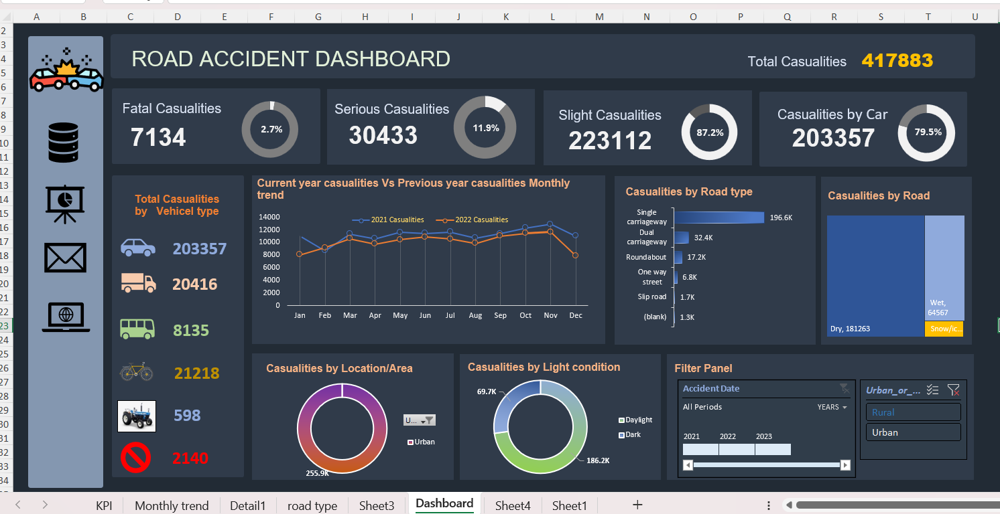
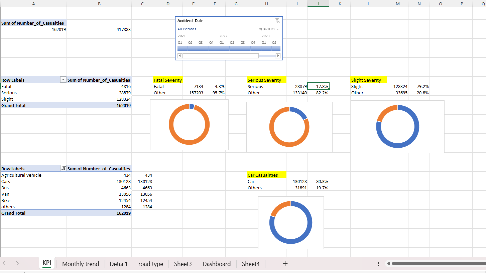

Road Accident Data Analysis (Excel)

## Project Overview
This project analyzes road accident data using Microsoft Excel to identify patterns, trends, and key risk factors contributing to accidents. The analysis helps in understanding when and where accidents occur most frequently.

## Tools Used
- Microsoft Excel  
- Data Cleaning  
- Pivot Tables  
- Charts & Dashboard  

## Steps Performed
- Cleaned the dataset by removing duplicates and handling missing values  
- Organized data for analysis  
- Created pivot tables to summarize accident data  
- Built charts to visualize trends  
- Developed a dashboard for better understanding  

## Key Insights
- Majority of accidents occur during night time  
- Higher number of accidents observed in urban areas  
- Peak accident occurrences during weekends  
- Weather conditions like rain increase accident frequency  

## Files in this Repository
- `Road Accident Data dashboard.xlsb` → Main Excel dashboard  
- `road accident data reduced.csv` → Dataset used for analysis  
- `dashboard.png`, `kpi.png` → Dashboard previews  

## Dashboard Preview

## 📝 Note
The dataset has been reduced for better performance and file size optimization while maintaining the overall trends and insights.
